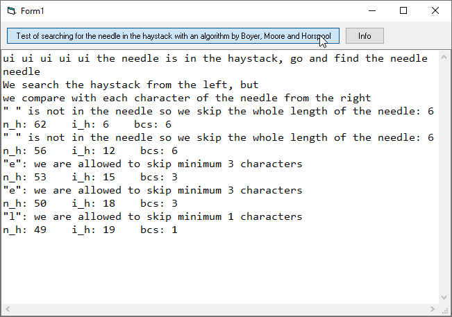

# Algo_BoyerMooreHorspool  
## Searching for a needle in a haystack  

 

Project started around mid 2008.  
Searching for the needle in a haystack ist easy because we have the algorithm invented by Boyer, Moore and Horspool.  

  
